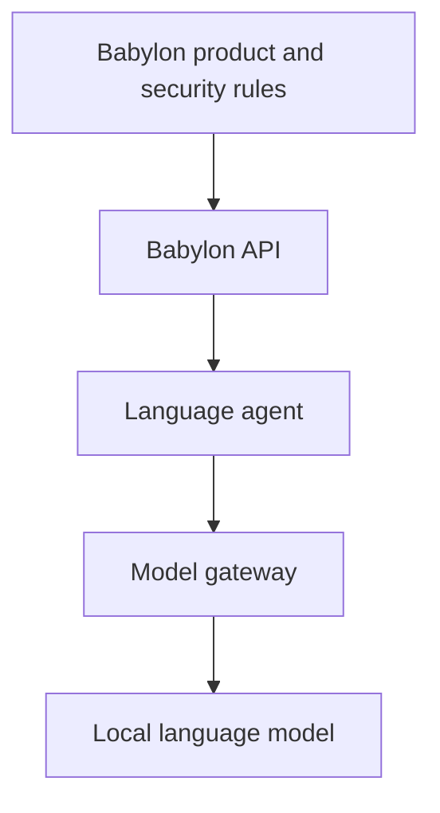

# Babylon local language system architecture

This document defines the intended boundaries, authority, processing flow and data-handling rules
for Babylon's local language system. The delivery states and model ordering described here are a
planned contract; implementation work and its status are tracked separately.

## Authority hierarchy

Authority flows from Babylon policy toward the local model. A lower layer cannot override a decision
made by a higher layer.

Model output is an untrusted translation proposal. It is neither a system instruction nor a new
product, security, routing or language decision. Prompts, message content and model responses cannot
change the authority hierarchy.

## Component responsibilities and trust boundaries

### Reverse proxy

The reverse proxy terminates TLS, routes requests, enforces request-size boundaries and provides
basic traffic protection. It does not select languages, recipients or models.

### Babylon API

The Babylon API authenticates the request, selects the recipient, loads the recipient profile and
locks the delivery target language before language processing begins. It remains the policy
enforcement point and does not delegate recipient or target-language authority to a model.

### Language agent

The language agent detects the source language, applies the selected wording style, coordinates
translation, validates the result and runs the bounded repair and fallback flow. It operates within
the target language fixed by the Babylon API.

### Model gateway

The model gateway restricts calls to allowed model roles, applies configurable timeouts, normalizes
failures and records provenance. Provenance for every delivered translation includes both the model
role and the exact model identifier, including when repair or fallback changes the model used.

### Models

Models produce candidate translations only. They do not authenticate users, choose recipients,
select the delivery language, authorize delivery, approve their own output or establish system
policy.

### Input and output guards

Input guards classify content independently before translation. Output guards independently verify
that a candidate is suitable for the locked target language before delivery. A model cannot approve
its own output, and a model assertion that its output is valid is not evidence of validity.

## Language principles

- The initial supported languages, as previously selected and documented, are English (`en`),
  Hungarian (`hu`) and Belarusian (`be`). The original product rationale remains authoritative; this
  architecture document does not replace or reinterpret it.
- The system detects the source language automatically.
- The recipient's delivery language comes from the recipient profile.
- A sender cannot change the recipient's delivery language.
- A user's own interface language is a separate preference from any recipient delivery language.
- The initial wording styles are formal, everyday and casual. Slang remains a later extension.
- The style selector changes wording style only; it cannot change the target language.

Predictive input similar to T9 is a planned later client feature. It may reduce typing errors, but
it is not part of the current language-agent implementation and cannot replace input validation.

## Input classification and invalid input

Language-independent content and genuinely uninterpretable text are distinct classes.
Language-independent content, such as an emoji-only message, URL, telephone number, identifier or
code fragment, may be forwarded unchanged when appropriate. It must not be rejected merely because
source-language detection is inapplicable.

If input appears to be text but cannot be interpreted reliably in any supported language, processing
ends as `invalid_input`:

- nothing is sent to the recipient;
- the original text remains in the sender's composer;
- the error is shown in the sender's interface language;
- the same unchanged, uninterpretable input is not retried automatically; and
- no model may invent an assumed meaning.

Classification must be conservative. Misspellings, slang, mixed-language text, personal names and
unusual wording do not by themselves make input invalid.

## Translation validation and recovery

A model response that does not match the locked target language is a rejected translation attempt.
The recipient never receives a rejected candidate. Recovery follows this bounded order:

1. Translate with the primary model.
2. Perform an independent target-language check.
3. If validation fails, make one constrained repair attempt with the same model.
4. If repair fails, translate again from the original source text with the secondary model.
5. Use the fallback model if needed and enabled.
6. If every model fails or is unavailable, enter `translation_pending`.
7. Store a short-lived encrypted job and perform bounded automatic retries.
8. Deliver only after a result passes independent validation.

There is no infinite retry path. Attempt limits and timeouts are configurable and must be selected
through implementation testing rather than fixed by this architecture document.

## Planned delivery contract

The following statuses are a planned contract. They do not yet amend the OpenAPI contract:

| Status                   | Meaning                                                                               |
| ------------------------ | ------------------------------------------------------------------------------------- |
| `delivered`              | The primary translation passed independent validation and was delivered.              |
| `delivered_after_repair` | A constrained repair passed validation and was delivered.                             |
| `delivered_via_fallback` | A secondary or enabled fallback model produced the validated delivered result.        |
| `delivered_unchanged`    | Translation was unnecessary because the languages matched or the content was neutral. |
| `translation_pending`    | No validated result is currently available; bounded deferred processing may continue. |
| `invalid_input`          | Text-like input could not be interpreted reliably, so nothing was delivered.          |

Every non-translation result records a truthful machine-readable reason. Unchanged delivery uses
`same_language` or `language_neutral`. Pending processing uses the most specific safe reason known:
`poor_network_coverage`, `model_unavailable`, `processing_timeout`, `technical_failure` or `other`.
Clients localize these codes into understandable text. A pending or generalized failure may be
shown with a sad emoji (`😔`); presentation must never replace the machine-readable reason.

Unintelligible text or voice input returns `unintelligible_text` or
`unintelligible_voice_input` together with the required action `correct_and_retry`. It is not merely
marked as failed: the sender is explicitly asked to correct the input before trying again.

Security work has priority. When a security control depends on a lower-level capability, that
capability is implemented first as a prerequisite; this ordering supports the security work and is
not a reason to omit or weaken the control.

## Model roles and provenance

The current ordering to be tested is:

- primary candidate: `gpt-oss:20b`;
- comparison and secondary candidate: `qwen3:8b`; and
- disabled fallback: `ministral-3:8b-instruct-2512-q4_K_M`.

This ordering remains configurable until real Pepper benchmarks are complete. Model switching during
development must never be invisible: each delivered translation carries the model role and exact
model identifier in its processing provenance.

## Data handling and retention

Babylon initially keeps no central conversation history. An undelivered translation job may exist as
short-lived encrypted processing state, subject to all of these constraints:

- it cannot become a conversation archive;
- it is deleted after successful delivery or expiry;
- logs contain neither message text nor secrets; and
- the client retains its own copy until it receives delivery acknowledgement.

Operational metadata may support validation, bounded retries and provenance without retaining the
conversation content centrally.

## Deployment uncertainties

The model endpoint remains configurable. This document does not select a final Pepper deployment
location or acceleration mode before all of the following measurements are complete:

- the 32 GB baseline;
- the 64 GB dual-channel measurement;
- CPU execution testing; and
- Intel UHD 630/Vulkan acceleration testing.

No client may connect directly to Ollama or to any model under any circumstances. Clients interact
only with the Babylon API, preserving authentication, recipient selection, target-language locking,
validation and delivery policy.

## Implementation plan

The implementation order and status are tracked in
[GitHub issue #1](https://github.com/StrobiSoft/Babylon/issues/1). This document defines the intended
architecture; the issue is the authoritative work tracker for delivering it incrementally.
